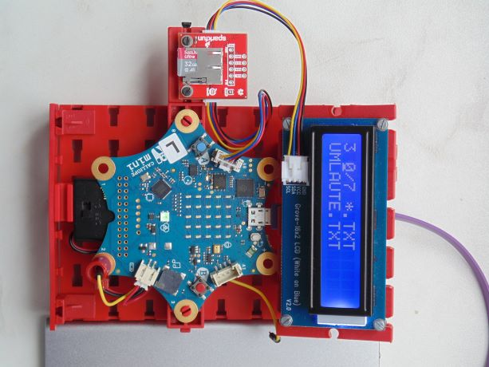

Diese Seite bei [https://calliope-net.github.io/i2c-speicherkarte-verwalten/](https://calliope-net.github.io/i2c-speicherkarte-verwalten/) öffnen.

### i2c Module an Calliope anstecken.

* [Grove - 16x2 LCD](https://wiki.seeedstudio.com/Grove-16x2_LCD_Series/)
* [SparkFun Qwiic OpenLog](https://www.sparkfun.com/products/15164)

Kabel und Adapter

* [Qwiic Cable - Grove Adapter](https://www.sparkfun.com/products/15109) (2 Stück)

Alle i2c Module werden parallel am linken Grove Steckverbinder A0 angeschlossen. 
i2c Module mit zwei Buchsen (z.B. Qwiic) können hintereinander gesteckt werden.

Für die Stromversorgung sollte Calliope über USB Kabel (an Computer oder Powerbank) angeschlossen sein.

#### .hex-Datei direkt auf Calliope laden, oder in MakeCode importieren.

* [mini-i2c-speicherkarte-verwalten.hex](mini-i2c-speicherkarte-verwalten.hex)
* [Schnappschuss (Bildschirmfoto mit den Blöcken)](mini-i2c-speicherkarte-verwalten.png)

#### Dieses Projekt von GitHub importieren, bearbeiten, mit Calliope testen.

Um dieses Repository in MakeCode zu importieren.

* öffne [https://makecode.calliope.cc](https://makecode.calliope.cc)
* klicke auf **Importieren** und dann auf **Importiere URL**
* kopiere die folgende **URL des Projekts** in die Zwischenablage (Strg-C)
* **calliope-net/i2c-speicherkarte-verwalten**
* füge sie auf der MakeCode Webseite ein (Strg-V) und klicke auf **Los geht's!**

### Bedienung der Calliope-App 'Speicherkarte verwalten'

* das Programm hat mehrere Zustände, die wichtigsten sind:
  * *start* (beim Start wurde eine Speicherkarte erkannt)
  * *dir*   (Directory von Speicherkarte wurde in internes Array eingelesen)
  * *read*  (Datei-Inhalt wurde in internes Array eingelesen)
  * *write* (Datei wurde auf Speicherkarte geschrieben)
* der Status bestimmt die Funktion von Knopf A/B
* im Status *start* (RGB-LED blau)
  * werden 'wildcards' wie \*.* angezeigt für die Verzeichnis Suche
  * **A geklickt** rückwärts (-1)
  * **B geklickt** vorwärts (+1)
  * **A+B geklickt** zu dem gewählten Suchmuster passende Datei-Namen einlesen
    * begrenzt auf 20 Dateinamen (kann im Programm geändert werden)
    * Status Wechsel zu → *dir*
  * **A halten** Aufruf der Funktion 'schreibeUmlaute'
  * **B halten** Aufruf der Funktion 'schreibeZeilen'
  * **A+B halten** Aufruf der Funktion 'loescheDateien'
* im Status *dir* (nach **A+B geklickt** RGB-LED grün)
  * wird jeweils einer der gefundenen Dateinamen angezeigt
  * **A geklickt** rückwärts (-1)
  * **B geklickt** vorwärts (+1)
  * **A+B geklickt** Status Wechsel zurück zu → *start*
  * **A halten** Dateigröße in Byte ermitteln und anzeigen
  * **B halten** aktuelle Datei löschen
  * **A+B halten** Datei-Inhalt einlesen und die ersten 32 Zeichen anzeigen
    * begrenzt auf 160 Byte (kann im Programm geändert werden)
    * Status Wechsel zu → *read*
* im Status *read* (nach **A+B halten** RGB-LED rot)
  * werden jeweils 32 Zeichen der eingelesenen Datei angezeigt
  * **A geklickt** rückwärts (-32 Zeichen)
  * **B geklickt** vorwärts (+32 Zeichen)
  * **A+B geklickt** Status Wechsel zurück zu → *start*
  * **A halten** Dateigröße in Byte ermitteln und anzeigen
  * **B halten** aktuelle Datei löschen
  * **A+B halten** frei
* im Status *write*
  * nach dem Schreiben auf die Speicherkarte
  * **A+B geklickt** Status Wechsel zurück zu → *start*
  * **A+B halten** Status Wechsel zurück zu → *start*
    * es wird syncFile aufgerufen, zum Entfernen der Speicherkarte

Die Funktion 'schreibeUmlaute' wurde mit Blöcken programmiert. Eine vorhandene Datei mit gleichem Name wird gelöscht.
Dann werden Umlaute und Sonderzeichen in eine neue Datei UMLAUTE.TXT geschrieben und wieder gelesen. Die Zeichen werden im LCD Display angezeigt.

Die Funktion 'schreibeZeilen' ist ein fertiger Block in LOG. In die Datei ASCII94.LOG werden Zeilen verschiedener Länge 0 bis 94 Zeichen
geschrieben, um die automatische Aufteilung in Blöcke zu 31 Byte zu testen. Diese Datei wird nicht gelesen.

Die Funktion 'loescheDateien' wurde mit Blöcken programmiert. Qwiic OpenLog legt immer neue Dateien LOG*.TXT mit fortlaufender Nummer
im Dateiname und ohne Inhalt an. Das Programm listet 10 solche Dateinamen auf, testet ob die Länge = 0 ist, löscht die Datei und schreibt
das Ergebnis in eine Protokolldatei REMOVE.LOG auf die Speicherkarte. Der Ablauf wird im LCD Display protokolliert.

### Erweiterungen

Die Calliope-App 'Speicherkarte verwalten' lädt folgende Erweiterungen:

Erweiterung für MakeCode|Blöcke zur Programmierung der i2c-Module
---|---
[calliope-net/bit](https://calliope-net.github.io/bit/) | Blöcke für HEX-Zahlen, bitweise Logik
[calliope-net/lcd-16x2](https://calliope-net.github.io/lcd-16x2/) | LCD-Display 16 Zeichen x 2 Zeilen
[calliope-net/openlog](https://calliope-net.github.io/openlog/) | Dateien auf Speicherkarte lesen/schreiben/löschen

> [Upates für Erweiterungen; Erweiterungen aus einem Projekt löschen.](https://calliope-net.github.io/i2c-liste#updates)

> [Alle i2c-Erweiterungen für MakeCode von calliope-net (Software).](https://calliope-net.github.io/i2c-liste#erweiterungen)

#### Calliope-Apps, .hex-Dateien, Bildschirmfotos mit Blöcken

> [Alle Beispiel-Projekte für MakeCode von calliope-net (Calliope-Apps).](https://calliope-net.github.io/i2c-liste#programmierbeispiele)

> GitHub-Profil calliope-net: [https://github.com/calliope-net](https://github.com/calliope-net)

### Bezugsquellen

> [Alle i2c-Module und Bezugsquellen (Hardware).](https://calliope-net.github.io/i2c-liste#bezugsquellen)

#### Metadaten (verwendet für Suche, Rendering)

* Calliope mini
* i2c
